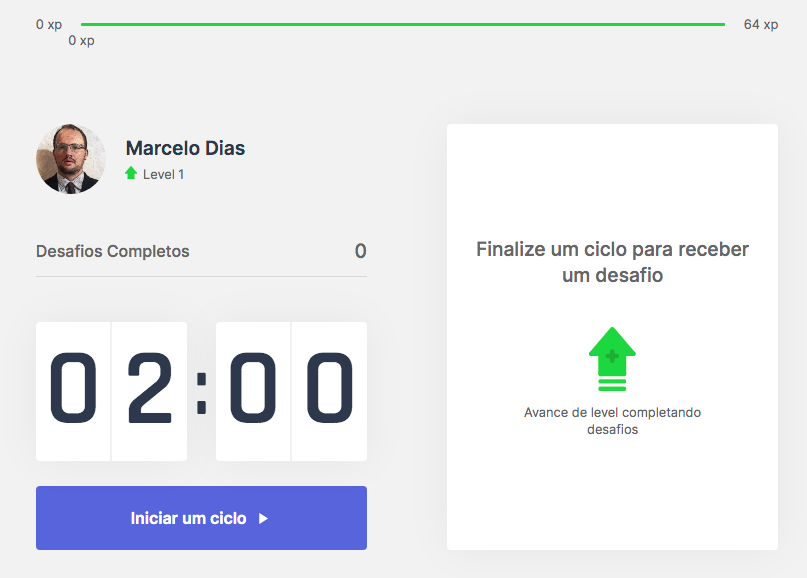
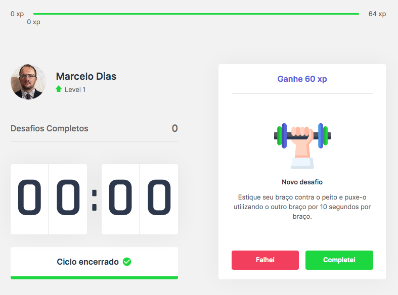
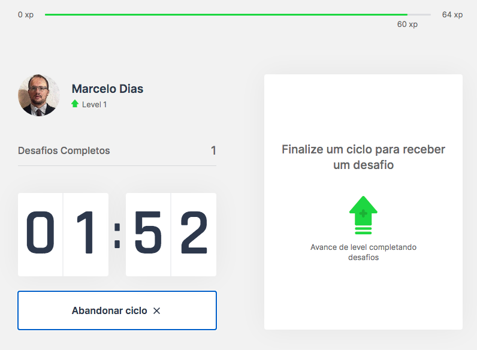

<h1 align="center">
    Move.it
</h1>
<p align="center"> Aplicativo desenvolvido durante a quarta edição da Next Level Week por <a href="https://rocketseat.com.br/">Rocketseat</a> 🚀 </p>


## 🎯 Objetivo

Controle o seu tempo, seja mais produtivo e cuide da sua saúde. O <a href="https://moveit-next-mdcarmo.vercel.app/"> Move.it </a> foi desenvolvido para gerenciamento do tempo, como na técnica do pomodoro, dividindo o trabalho em períodos de 25 minutos (No exemplo, deixei com apenas 2 minutos para ficar mais fácil o entendimento). Depois desse tempo, ele libera um desafio, que é um alongamento para o corpo ou exercícios para os olhos. Cada desafio tem seus pontos de xp e, acumulando os pontos você sobe de nível. (Os desafios podem ser facilmente customizados.)

<p float="center">
  
  
  
  
</p>

O layout do Figma disponibilizado pela equipe da Rockset se encontra aqui: <a href="https://www.figma.com/file/ge20pu3ofMOKoliUyKx1Nl/?viewer=1&node-id=">here</a>.

## 🛠 Tecnologias utilizadas:

As seguintes ferramentas foram utilizadas na construção do projeto:

- [ReactJS](https://reactjs.org)
- [NextJS](https://nextjs.org)
- [NodeJS](https://nodejs.org/en/)

## 👷️ Começando

Essas instruções fornecerão uma cópia do projeto instalado e funcionando em sua máquina local para fins de desenvolvimento e teste.

### Pré Requisitos

Você precisará ter o yarn instalado em sua máquina. Para isso, basta executar:

```bash
npm install -g yarn
```
É possivel utilizar o npm também como gerenciador de pacotes. 

### Instalando

Para executar o projeto pela ** primeira ** vez, você deve seguir estas etapas:

Clone o repositório no github:

```bash
git clone https://github.com/mdcarmo/moveit-next.git
```

Instale as dependencias e inicie o projeto

```bash
yarn
```

```bash
yarn dev
```

Agora, e se deu tudo certo voce deverá ver o aplicativo rodando em [localhost:3000](http://localhost:3000)

## 💻️ Autor
**Marcelo Dias** - [mdcarmo](https://github.com/mdcarmo)

<h2 id="license"> 📝 License </h2>

This project is under the MIT license.
